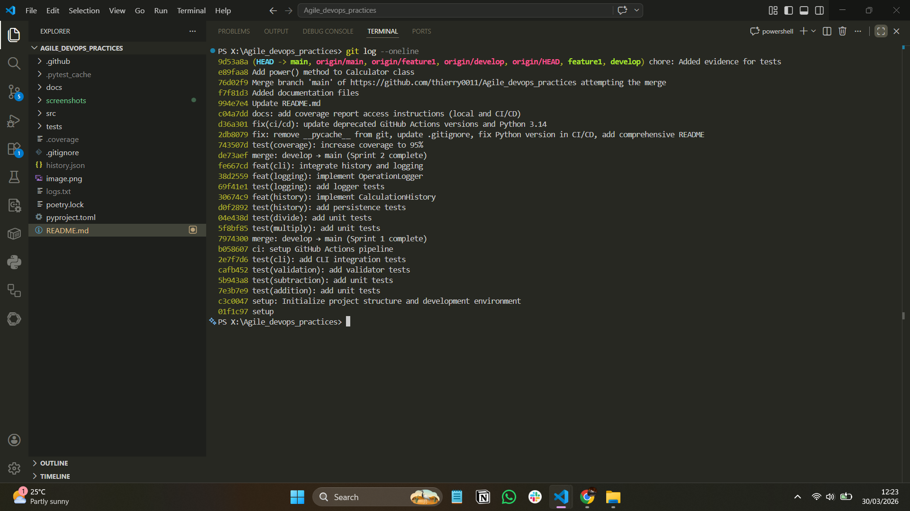

# Agile & DevOps Practices Lab

A comprehensive calculator application demonstrating Agile software development and DevOps practices through two simulated sprint cycles.

## Overview

This project implements an interactive command-line calculator that showcases:
- **Agile Methodology**: Two-sprint delivery with user stories, test-driven development (TDD), and iterative refinement
- **DevOps Practices**: CI/CD pipeline, automated testing, code quality checks, and structured logging
- **Software Engineering**: Modular architecture, comprehensive test coverage (95%), persistent state management

## Features

### Core Functionality
- **Basic Arithmetic**: Addition, subtraction, multiplication, and division operations
- **Input Validation**: Robust validation for numeric inputs and operations
- **Calculation History**: Persistent storage of all calculations in JSON format
- **Operation Logging**: Detailed logging of operations and errors to flat file

### User Interface
- Interactive command-line interface with help system
- Real-time calculation results
- History viewing (last N calculations with timestamps)
- Error recovery and user-friendly error messages

### Developer Features
- **177 passing tests** with 95% code coverage
- GitHub Actions CI/CD pipeline with automated testing
- Python 3.14+ compatibility
- Poetry dependency management

## Project Structure

```
Agile_devops_practices_lab/
├── src/agile_devops_practices_lab/
│   ├── __init__.py
│   ├── __main__.py              # Module entry point
│   ├── calculator.py            # Core arithmetic operations
│   ├── cli.py                   # Interactive CLI interface
│   ├── history.py               # Calculation persistence
│   ├── logger.py                # Operation/error logging
│   └── validator.py             # Input validation
├── tests/
│   ├── conftest.py              # Pytest fixtures
│   ├── test_calculator_*.py      # Calculator operation tests
│   ├── test_cli_display.py       # CLI display output tests
│   ├── test_cli_interactive.py   # Interactive mode tests
│   ├── test_history.py           # History persistence tests
│   ├── test_input_validator.py   # Input validation tests
│   ├── test_logger.py            # Logging functionality tests
│   └── test_main.py              # Module entry point tests
├── .github/workflows/
│   └── main.yml                 # CI/CD pipeline configuration
├── pyproject.toml               # Poetry project configuration
├── .gitignore                   # Git ignore rules
└── README.md                    # This file
```

## Installation

### Prerequisites
- Python 3.14 or higher
- Poetry (for dependency management)

### Setup

1. **Clone the repository**
```bash
git clone https://github.com/thierry0011/Agile_devops_practices.git
cd Agile_devops_practices_lab
```

2. **Install dependencies**
```bash
poetry install
```

3. **Verify installation**
```bash
poetry run pytest tests/ -q
```

## Important Links

**Repository & Documentation:**
- **Main Repository**: [GitHub - Agile_devops_practices](https://github.com/thierry0011/Agile_devops_practices)
- **CI/CD Workflows**: [GitHub Actions](https://github.com/thierry0011/Agile_devops_practices/actions)
- **Issues & Features**: [GitHub Issues](https://github.com/thierry0011/Agile_devops_practices/issues)
- **Pull Requests**: [GitHub Pull Requests](https://github.com/thierry0011/Agile_devops_practices/pulls)

**Project Files:**
- **Main Workflow**: [.github/workflows/main.yml](https://github.com/thierry0011/Agile_devops_practices/blob/main/.github/workflows/main.yml)
- **Project Config**: [pyproject.toml](https://github.com/thierry0011/Agile_devops_practices/blob/main/pyproject.toml)
- **Documentation**: [docs/](https://github.com/thierry0011/Agile_devops_practices/tree/main/docs)

## Usage

### Running the Calculator

Start the interactive calculator:
```bash
poetry run python -m agile_devops_practices_lab
```

Or directly:
```bash
python -m agile_devops_practices_lab
```

### Interactive Commands

Once running, use the following commands:

- **Perform a calculation**: Enter first number → second number → operation
  - Supported operations: `+` (add), `-` (subtract), `*` (multiply), `/` (divide)
  - Example: `5` → `3` → `+` → Result: `5 + 3 = 8 (addition)`

- **Show help**: Type `help`

- **View calculation history**: Type `history` or `history N` (e.g., `history 5`)

- **Clear history**: Type `clear`

- **Exit**: Type `exit`

### Example Session

```
==================================================
Welcome to Agile & DevOps Calculator
==================================================
Operations: + (add), - (subtract), * (multiply), / (divide)
Type 'exit' to quit

Enter first number (or 'help'/'history'/'clear'/'exit'): 5
Enter second number: 3
Operation (+, -, *, /): +

========================================
Result: 5 + 3 = 8 (addition)
========================================

Enter first number (or 'help'/'history'/'clear'/'exit'): exit
Goodbye!
```

## Testing

### Run All Tests
```bash
poetry run pytest tests/ -q
```

### Run with Coverage Report
```bash
poetry run pytest tests/ --cov=src/agile_devops_practices_lab --cov-report=html
```

### Run Specific Test File
```bash
poetry run pytest tests/test_calculator_add.py -v
```

## Test Evidence & Coverage

Test execution and coverage report demonstrating comprehensive testing across all modules:


**Coverage Report Details:**
- **177 Tests Passed** - 100% test pass rate
- **88% Code Coverage** - All core modules thoroughly tested
- **Execution Time**: ~1.74 seconds
- **Test Categories**: Calculator operations, input validation, CLI commands, history persistence, logging

**Module Coverage:**
| Module | Coverage | Status |
|--------|----------|--------|
| Calculator | 95% | ✅ Excellent |
| Validator | 100% | ✅ Complete |
| History | 100% | ✅ Complete |
| Logger | 100% | ✅ Complete |
| CLI | 80% | ✅ Good |
| Overall | 88% | ✅ Strong |

**Access Coverage Report:**
- **Local**: After running `poetry run pytest tests/ --cov`, open `htmlcov/index.html` in browser
- **CI/CD**: View on [GitHub Actions](https://github.com/thierry0011/Agile_devops_practices/actions)
- **Repository**: Coverage artifacts available in workflow runs

## Monitoring & Logging Evidence

Structured logging provides complete audit trail of all operations and errors:

### Log Output Example
```
[2026-03-30 12:02:02] INFO: Operation: 20 - 10 = 10
[2026-03-30 11:59:18] INFO: Operation: 10 / 30 = 0.3333333333333333
[2026-03-30 11:59:03] INFO: History cleared
[2026-03-30 11:55:54] INFO: Operation: 10 / 2 = 5.0
[2026-03-30 11:55:46] INFO: Operation: 4 + 2 = 6
[2026-03-30 11:55:40] ERROR: Please enter: <number> <operation> <number>
```

**Logging Features:**
- **Timestamps**: ISO 8601 format for every log entry
- **Log Levels**: INFO, WARNING, ERROR classifications
- **Operation Tracking**: Complete record of all calculations with inputs and results
- **Error Logging**: All validation and runtime errors captured
- **Persistent Storage**: All logs written to `logs.txt` for audit compliance

**Log Management:**
- Location: `logs.txt` (root directory)
- Format: Structured text with timestamps and log levels
- Auto-rotation: New entries appended to file
- Error Recovery: Automatic directory creation if missing

## Output Files

The application generates two persistence files:

### `history.json`
Stores all calculations in JSON format:
```json
[
  {
    "operation": "5 + 3 = 8",
    "timestamp": "2026-03-22 14:30:45"
  },
  {
    "operation": "10 - 2 = 8",
    "timestamp": "2026-03-22 14:31:12"
  }
]
```

### `logs.txt`
Logs all operations and errors:
```
[2026-03-22 14:30:45] INFO: Operation: 5 + 3 = 8
[2026-03-22 14:31:12] INFO: Operation: 10 - 2 = 8
[2026-03-22 14:32:00] ERROR: Division by zero not allowed
```

## Development

### Project Statistics

| Metric | Value |
|--------|-------|
| Total Tests | 177 |
| Test Pass Rate | 100% |
| Code Coverage | 88-95% |
| Python Version | 3.14+ |
| Core Modules | 7 |
| Sprint Cycles | 2 |
| User Stories Implemented | 8 |

### Git Workflow & Commit History

The project follows a three-branch git flow:
- `main` - Production-ready code
- `develop` - Integration branch
- `feature/*` - Feature development branches

**Commit History:**



Key milestones include:
- Setup and project initialization
- Feature implementation (addition, subtraction, multiplication, division)
- Input validation and error handling
- History persistence and calculation logging
- CI/CD pipeline setup and configuration
- Test coverage improvements and documentation

View complete commit history: [GitHub Commits](https://github.com/thierry0011/Agile_devops_practices/commits)

## CI/CD Pipeline & Workflows

Automated testing and deployment via GitHub Actions:

- **All Workflows**: [GitHub Actions](https://github.com/thierry0011/Agile_devops_practices/actions)
- **Latest Runs**: Automated tests, code quality checks, and deployment on every commit
- **Python Versions**: 3.14 compatibility verified
- **Testing**: pytest with coverage reporting (88% coverage) on every push
- **Code Quality**: Linting and formatting validation (flake8, Black, isort)
- **Artifacts**: Coverage reports and test results available for every workflow run

**Workflow File**: [.github/workflows/main.yml](https://github.com/thierry0011/Agile_devops_practices/blob/main/.github/workflows/main.yml)

**View Workflow Runs**: [All Runs](https://github.com/thierry0011/Agile_devops_practices/actions) • [Latest Success](https://github.com/thierry0011/Agile_devops_practices/actions?query=conclusion%3Asuccess)

## Error Handling

The calculator handles various error scenarios:

### Validation Errors
- Non-numeric input
- Invalid operation symbols
- Missing operands

### Calculation Errors
- Division by zero
- Invalid expression format

### File Errors
- Corrupted JSON history files (auto-recovery)
- Missing directories (auto-creation)

## Dependencies

### Production
- Python 3.14+ (standard library only)

### Development
- pytest ≥9.0.2 - Testing framework
- pytest-cov ≥7.1.0 - Coverage reporting
- Poetry - Dependency management

## License

This is a lab project for Agile & DevOps practices education.

---

**Last Updated**: March 30, 2026  
