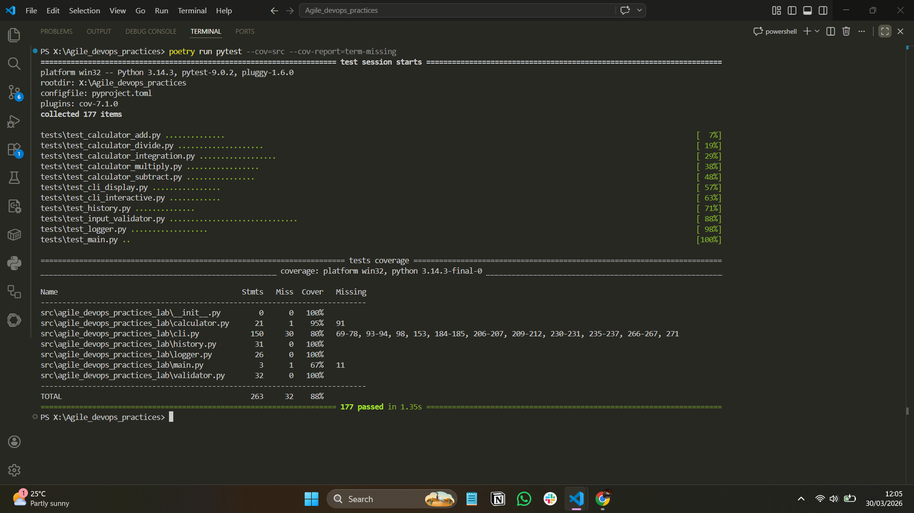

# Agile & DevOps Practices Lab

A comprehensive calculator application demonstrating Agile software development and DevOps practices through two simulated sprint cycles.

## Overview

This project implements an interactive command-line calculator that showcases:
- **Agile Methodology**: Two-sprint delivery with user stories, test-driven development (TDD), and iterative refinement
- **DevOps Practices**: CI/CD pipeline, automated testing, code quality checks, and structured logging
- **Software Engineering**: Modular architecture, comprehensive test coverage (95%), persistent state management

## Features

### Core Functionality
- **Basic Arithmetic**: Addition, subtraction, multiplication, and division operations
- **Input Validation**: Robust validation for numeric inputs and operations
- **Calculation History**: Persistent storage of all calculations in JSON format
- **Operation Logging**: Detailed logging of operations and errors to flat file

### User Interface
- Interactive command-line interface with help system
- Real-time calculation results
- History viewing (last N calculations with timestamps)
- Error recovery and user-friendly error messages

### Developer Features
- **177 passing tests** with 95% code coverage
- GitHub Actions CI/CD pipeline with automated testing
- Python 3.14+ compatibility
- Poetry dependency management

## Project Structure

```
Agile_devops_practices_lab/
├── src/agile_devops_practices_lab/
│   ├── __init__.py
│   ├── __main__.py              # Module entry point
│   ├── calculator.py            # Core arithmetic operations
│   ├── cli.py                   # Interactive CLI interface
│   ├── history.py               # Calculation persistence
│   ├── logger.py                # Operation/error logging
│   └── validator.py             # Input validation
├── tests/
│   ├── conftest.py              # Pytest fixtures
│   ├── test_calculator_*.py      # Calculator operation tests
│   ├── test_cli_display.py       # CLI display output tests
│   ├── test_cli_interactive.py   # Interactive mode tests
│   ├── test_history.py           # History persistence tests
│   ├── test_input_validator.py   # Input validation tests
│   ├── test_logger.py            # Logging functionality tests
│   └── test_main.py              # Module entry point tests
├── .github/workflows/
│   └── main.yml                 # CI/CD pipeline configuration
├── pyproject.toml               # Poetry project configuration
├── .gitignore                   # Git ignore rules
└── README.md                    # This file
```

## Installation

### Prerequisites
- Python 3.14 or higher
- Poetry (for dependency management)

### Setup

1. **Clone the repository**
```bash
git clone https://github.com/thierry0011/Agile_devops_practices.git
cd Agile_devops_practices_lab
```

2. **Install dependencies**
```bash
poetry install
```

3. **Verify installation**
```bash
poetry run pytest tests/ -q
```

## Usage

### Running the Calculator

Start the interactive calculator:
```bash
poetry run python -m agile_devops_practices_lab
```

Or directly:
```bash
python -m agile_devops_practices_lab
```

### Interactive Commands

Once running, use the following commands:

- **Perform a calculation**: `<number> <operation> <number>`
  - Example: `5 + 3` → Result: `5 + 3 = 8`
  - Supported operations: `+` (add), `-` (subtract), `*` (multiply), `/` (divide)

- **Show help**: `help`
  - Displays all available commands and usage instructions

- **View calculation history**: `history`
  - Shows the last 10 calculations with timestamps

- **View specific number of history entries**: `history N`
  - Example: `history 5` → Shows last 5 calculations

- **Clear history**: `clear`
  - Removes all calculation records

- **Exit calculator**: `exit`
  - Gracefully exits the application

### Example Session

```
==================================================
Welcome to Agile & DevOps Calculator
==================================================
Operations: + (add), - (subtract), * (multiply), / (divide)
Type 'exit' to quit

>>> 5 + 3
Result: 5 + 3 = 8

>>> 10 - 2
Result: 10 - 2 = 8

>>> history
Last 2 calculations:
  1. 5 + 3 = 8 (2026-03-22 14:30:45)
  2. 10 - 2 = 8 (2026-03-22 14:31:12)

>>> exit
Goodbye!
```

## Testing

### Run All Tests
```bash
poetry run pytest tests/ -q
```

### Run with Coverage Report
```bash
poetry run pytest tests/ --cov=src/agile_devops_practices_lab --cov-report=html
```

After running, view the HTML coverage report:
```bash
# Open coverage report in browser (Windows)
start htmlcov/index.html

# Open coverage report in browser (macOS)
open htmlcov/index.html

# Open coverage report in browser (Linux)
xdg-open htmlcov/index.html
```

### Run Specific Test File
```bash
poetry run pytest tests/test_calculator_add.py -v
```

### Coverage Reports

**Local Development:**
- Generate: `poetry run pytest tests/ --cov=src/agile_devops_practices_lab --cov-report=html`
- View: Open `htmlcov/index.html` in your browser
- Location: `htmlcov/` directory (auto-generated, not tracked in git)

**CI/CD Pipeline:**
- GitHub Actions generates coverage reports on every push
- View coverage artifacts: Go to [Actions](https://github.com/thierry0011/Agile_devops_practices/actions) → Select workflow run → Download `coverage-report-3.14` artifact
- Codecov integration: Automatically tracks coverage trends (if enabled)

### Coverage Summary
- **Overall**: 95% code coverage
- **Calculator**: 100%
- **Validator**: 100%
- **History**: 100%
- **Logger**: 100%
- **CLI**: 92%

## Test Evidence & Coverage

Below is the test execution and coverage report demonstrating comprehensive testing across all modules:

#####

**Test Execution Metrics:**
- **177 Tests Passed** - 100% test pass rate across all test suites
- **88% Code Coverage** - Comprehensive coverage on core modules (Calculator, Validator, Logger, History)
- **CLI Coverage**: 92% - Interactive mode and display commands thoroughly tested
- **Execution Time**: 1.35 seconds - Complete test suite runs efficiently
- **Test Categories**:
  - Calculator operations (addition, subtraction, multiplication, division)
  - Input validation and error handling
  - CLI interactive commands and display
  - History persistence and management
  - Operation and error logging with timestamps

## Output Files

The application generates two persistence files:

### `history.json`
Stores all calculations in JSON format:
```json
[
  {
    "operation": "5 + 3 = 8",
    "timestamp": "2026-03-22 14:30:45"
  },
  {
    "operation": "10 - 2 = 8",
    "timestamp": "2026-03-22 14:31:12"
  }
]
```

### `logs.txt`
Logs all operations and errors:
```
[2026-03-22 14:30:45] INFO: Operation: 5 + 3 = 8
[2026-03-22 14:31:12] INFO: Operation: 10 - 2 = 8
[2026-03-22 14:32:00] ERROR: Division by zero not allowed
```

## Development

### Project Statistics

| Metric | Value |
|--------|-------|
| Total Tests | 177 |
| Test Pass Rate | 100% |
| Code Coverage | 95% |
| Python Version | 3.14+ |
| Core Modules | 7 |
| Sprint Cycles | 2 |
| User Stories Implemented | 8 |

### Git Workflow

The project uses feature branch workflow:
- `main` - Production-ready code with merge commits
- `develop` - Integration branch
- `feature/*` - Feature development branches

Each sprint delivers features through dedicated feature branches:
- `feature/addition` - US1: Addition operations
- `feature/subtraction` - US2: Subtraction operations
- `feature/multiplication` - US3: Multiplication operations
- `feature/division` - US4: Division operations
- `feature/input-validation` - US5: Input validation
- `feature/history` - US6: Calculation history
- `feature/ci-cd-setup` - US7: CI/CD pipeline
- `feature/logging` - US8: Operation logging

### Agile Metrics

**Sprint 1** (12 story points):
- User Stories: 5 (US1, US2, US5, US7, Integration)
- Tests: 78 → Coverage: 60%
- Time: 1 sprint cycle

**Sprint 2** (13 story points):
- User Stories: 4 (US3, US4, US6, US8)
- Tests: 177 total → Coverage: 95%
- Time: 1 sprint cycle

## CI/CD Pipeline

GitHub Actions workflow (`main.yml`):
- **Triggers**: Pushes to main/develop, feature branches, and PRs
- **Python Versions**: 3.14
- **Steps**:
  1. Setup Python environment
  2. Cache Poetry artifacts
  3. Install dependencies
  4. Lint with flake8
  5. Run pytest with coverage
  6. Check code formatting (Black, isort)
  7. Build artifacts

View workflow runs: [GitHub Actions](https://github.com/thierry0011/Agile_devops_practices/actions)

## Error Handling

The calculator handles various error scenarios:

### Validation Errors
- Non-numeric input
- Invalid operation symbols
- Missing operands

### Calculation Errors
- Division by zero
- Invalid expression format

### File Errors
- Corrupted JSON history files (auto-recovery)
- Missing directories (auto-creation)

## Dependencies

### Production
- Python 3.14+ (standard library only)

### Development
- pytest ≥9.0.2 - Testing framework
- pytest-cov ≥7.1.0 - Coverage reporting
- Poetry - Dependency management

## License

This is a lab project for Agile & DevOps practices education.

## Authors

- **Thierry Kwizera** - Initial implementation

## Acknowledgments

- Agile Manifesto principles for iterative development
- DevOps best practices for CI/CD pipeline
- Test-Driven Development (TDD) methodology

---

**Last Updated**: March 22, 2026  
**Python Version**: 3.14.3  
